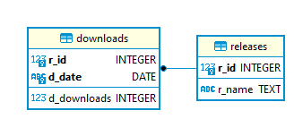

# sdm.demo.python.tkinter.sqlite3.github-stat
Python/Tkinter application to collect and display statistics from GitHub repo API.

https://docs.github.com/en/rest/reference/repos

Python3 + Tkinter, SQLite3, PyCharm + [SQL DAL Maker](https://github.com/panedrone/sqldalmaker) plugin. 

